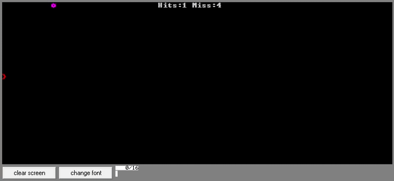
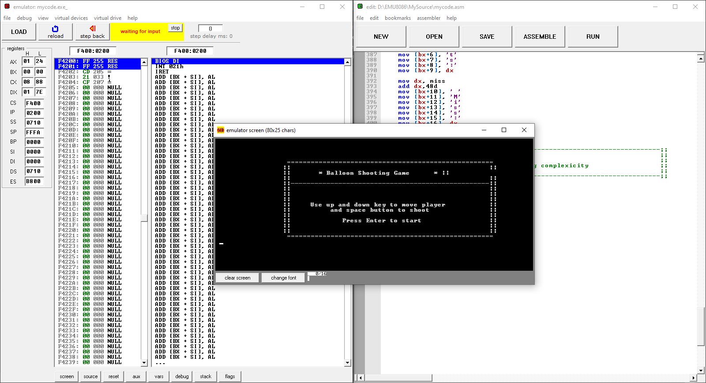

# 🎈 Balloon Shooting Game

A real-time **Balloon Shooting Game** built entirely in **x86 Assembly**, using direct video memory writes, keyboard interrupts, and BIOS/DOS interrupt calls. Developed as a semester project to demonstrate low-level, machine-code-level game logic.

## 📋 Overview

The player controls a shooter that can move up and down on the screen and fire arrows at balloons floating across the display. Hits and misses are tracked and displayed live, and the game ends after a set number of missed balloons — after which the player can restart from the Game Over screen.

The entire game — input handling, collision detection, rendering, and scoring — is written using direct writes to video memory (segment `0B800h`) rather than any high-level graphics library.

## ✨ Features

- **Player Movement** — Move up/down using the keyboard; player position is tracked and redrawn each frame
- **Shooting Mechanic** — Fire an arrow with the spacebar; only one arrow can be active at a time until it's hidden/reset
- **Balloon Spawning** — A new balloon spawns and scrolls across the screen after each hit or miss
- **Collision Detection** — Compares the arrow's position against the balloon's position each loop to detect a hit
- **Live Score Tracking** — Displays running **Hits** and **Misses** counters on screen, updated in real time
- **Game Over Condition** — Game ends automatically after **9 missed balloons**
- **Restart Flow** — Press Enter on the Game Over screen to reset all variables and play again
- **Start Menu** — Displays instructions (movement/shoot keys) before the game begins

## 🎮 Controls

| Key | Action |
|---|---|
| `Up Arrow` | Move player up |
| `Down Arrow` | Move player down |
| `Spacebar` | Shoot an arrow |
| `Enter` | Start game / restart after Game Over |

## 📸 Demo

### Gameplay Recording

### Code Running in emu8086

> Both the source code execution and live gameplay output are shown above, captured while running in **emu8086**.

## 🛠️ Concepts Demonstrated

- Direct video memory manipulation (writing to segment `0B800h` for text-mode rendering)
- BIOS keyboard interrupts (`INT 16h`) for key detection
- DOS interrupts (`INT 21h`) for string output, sound, and character input
- Video mode interrupt (`INT 10h`) for screen clearing
- Real-time game loop architecture
- Collision detection using position comparison
- Manual score formatting and display using ASCII arithmetic
- State management using global variables (position, direction, status flags)
- Procedure-based code organization (`show_score`, `clear_screen`)

## 🧱 Core Variables

| Variable | Purpose |
|---|---|
| `player_pos` | Current screen position of the player |
| `arrow_pos` / `arrow_status` / `arrow_limit` | Tracks the arrow's position, whether it's active, and where it should disappear |
| `loon_pos` / `loon_status` | Tracks the balloon's position and active status |
| `direction` | Current player movement direction (`8` = up, `2` = down) |
| `hits` / `miss` | Score counters |
| `state_buf` | Buffer used to build and display the live score string |

## ▶️ How to Run

This project was built and tested specifically for **emu8086**:

1. Download and open [emu8086](https://emu8086.en.lo4d.com/download)
2. Open `balloon.asm` in the emulator
3. Compile/Assemble the program
4. Run it — the start menu will appear with instructions
5. Press **Enter** to begin playing

> ⚠️ This program uses direct video memory addressing and BIOS/DOS interrupts specific to a 16-bit real-mode DOS environment. It will not run as-is on modern 32/64-bit operating systems without a DOS emulator like emu8086 or DOSBox with an appropriate assembler/linker (e.g. MASM/TASM).

## 🎓 About

This project was built as part of my Computer Science coursework, exploring low-level programming concepts — direct hardware/memory interaction, interrupt-driven input handling, and real-time rendering — entirely in **x86 Assembly language**.
